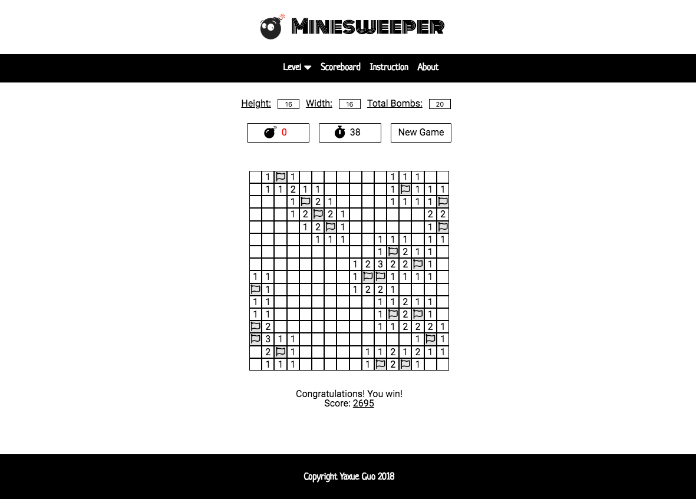

# Minesweeper v1.0 💣

This is a JavaScript version Minesweeper game based on ES6 and JQuery. Only web version supperted so far (you need play in a browser of your computer), and please make sure your window is big enough for bigger minefields or they will wrap and you cannot play under such situation. 

## Design and Development

  * Followed HTML5 and CSS3 standards. Responsive layout by flex for *header*, *nav*, *section*, and *footer* for the whole page layout as well as subelement's layout, for example, the navigation bar.
  
```
header, nav ul, section, footer, .message-field, .control-field-1, .control-field-2 {
    display: flex;
    flex-wrap: wrap;
    list-style: none;
    justify-content: center;
    align-items: center;
}
```

  * Used a css trick to mimic a fake *AJAX* effect by toggling the display attribute of *main section*, *scoreboard section*, *instruction section* and *about section* between 'flex' and 'none'. They are actually four sections within one page instead of four pages.
  
```
// For example, when click scoreboard, style for four sections will change using JQuery.
 $("#scoreboard").click(function() {
      $(".score-page").css("display", "flex");
      $(".main").css("display", "none");
      $(".instruction-page").css("display", "none");
      $(".about-page").css("display", "none");
  });
```
  
  * Utilized ES6 syntactic suger of *class* for the purpose of OOP. Built a class called **Mine** to abstract the whole minefield, accept user input to adjust the size as well as bomb numbers, and generate bomb location randomly.

```
class Mine {
    constructor(height, width, total_bomb) {
        this.height = height;
        this.width = width;
        this.total_bomb = total_bomb;
        this.mine = [];
    }

    createMine() {
        for(let i = 0; i < this.height + 2; i++){
            this.mine[i] = [];
            for (let j = 0; j < this.width + 2; j++){
                this.mine[i][j] = 0;
            }
        }

        // Scatter bombs randomly to the 2d array. 1 stands for bomb, 0 - no bomb.
        for (let i = 0; i < this.total_bomb; i++) {
            let location = this.generateRandomLocation();
            let x = location[0];
            let y = location[1];

            this.mine[x][y] = 1;
        }

        return this.mine;
    }

    // Output: [x,y], x -> [1, height], y -> [1, width].
    generateRandomLocation(){
        let x = Math.floor(Math.random() * this.height + 1);
        let y = Math.floor(Math.random() * this.width + 1);
        if (this.mine[x][y] === 0) {
            return [x,y];
        } else {
            return this.generateRandomLocation();
        }
    }
}
```

## Get started

*1.* Start mode. You are presented with a board of squares. Some contain 💣，others don't. 

   * Number of unmarked bombs 💣 will be shown, as well as the time 🕙 you spent.

   * You can customize the height and width: *8 \* 8* at minimum and *30 \* 40* at max as well as bomb number: *1* at minimum and *height \* width - 1* at max. 

   * Click the *New Game* button to start after customization, then clock will start.

   * Also, a dropdown list is provided to choose pre-set difficulty level: *Beginner*, *Intermediate* and *Expert*. Clock will start right after your click. 


***

*2.* Play moves.

  * *Left click* any square you find safe, and a number of how many bombs around this field (above, below, left, right and 4 diagonals) will appear. If this number is 0, the click will automatically open the 8 adjacent fields since it is safe to do so.
  
  * **Quick tip**: When a clicked field has same marked adjacent fields as it indicates, *left click* this field will automatically reveal surrounding fields. If the marked fields have any mistake, then fail. This can help you quickly clear safe fields instead of clicking one by one.
  
  * You can set 🚩 on a square by *right click* or *shift + left click* to mark the square that you think has a bomb. 
  
  * Repeat once to cancel the mark and a ❓ will appear.  
  
  * Repeat  again to cancel the ❓ and return to unmarked status.


***

*3.* Win/lose rules.

  * If you left click on a square containing a bomb, you lose the game 😔.
  
  * If you managed to mark all bombs or revealed all safe squares, you win 😄. 
  
 



***

*4.*  Scoreboard.  

  * When you win a game, you will get a score calculated based on time and difficulty. 
  
  * Click *scoreboard* on the top menu to see your score history. Only local score history for the same loading page so far.


## Author

* *Yaxue Guo* independently designed UI, developed functions and tested the game. All codes started from scratch.

## Acknowledgement

* This minesweeper game is based on the original Windows version of the game. Every release of Windows since has had a version of this game. 

* The history of minesweeper goes back to early 80's with many mine-type games being released in that period. The earliest proven ancestor of minesweeper is Mined-Out, which was released for the Sinclair Spectrum in 1983.

